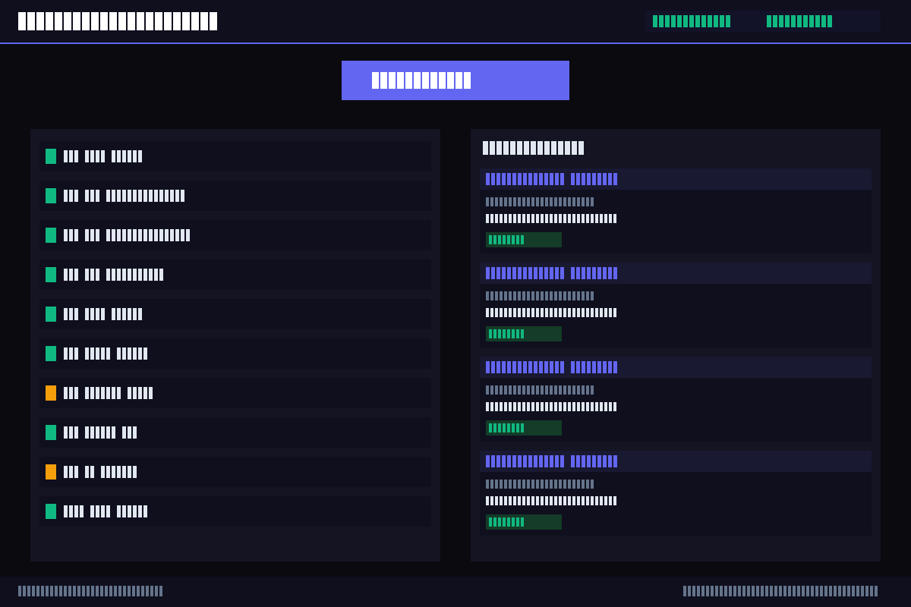

# XRPFi Verifiable Copilot


**0G APAC Hackathon 2026 — Track 2: Agentic Trading Arena | by FlareForward**

> **0G Mainnet Contract:** [`0x01fE5698a2448d0fc336295df9977796030C79C4`](https://chainscan.0g.ai/address/0x01fE5698a2448d0fc336295df9977796030C79C4)  
> **iNFT Demo Tx:** [`0xbe0cf7c8...`](https://chainscan.0g.ai/tx/0xbe0cf7c81658751ec40d67d871a996bba5799061348f4fe916c190f05aff9edd) — Token ID 1  
> **Explorer:** https://chainscan.0g.ai

A 2-agent AI system that helps XRP holders enter Flare DeFi end-to-end — with every decision verified on-chain and stored as an iNFT on 0G.

---

## What It Does

XRP has millions of holders who want to earn yield but face a complex path: bridge to Flare, mint FXRP via FAssets, navigate DeFi venues, manage collateral. Our AI copilot walks them through all of it — and produces a verifiable audit trail so anyone can prove what the AI actually did.

**The "oh wow" moment:** Watch an AI agent mint FXRP from a 100-XRP fixture, route it to the highest-yield venue, and produce an iNFT on 0G that any judge can click to verify every decision.

---

## System Architecture

```
User → mint-helper.eth (Agent A, AXL node 1)
            │ FAssets v1.3 mint + FDC attestation + FTSO pricing
            │
            ▼ Gensyn AXL (cross-node: node 1 → node 2)
            │
         yield-router.eth (Agent B, AXL node 2)
            │ Flare DeFi venue catalog + Uniswap swap + rebalance policy
            │
            ▼
      0G Storage → iNFT (ERC-7857) on 0G mainnet (Chain ID 16661)
            │
            ▼
      chainscan.0g.ai — permanent, clickable proof
```

See [docs/architecture.md](docs/architecture.md) for full diagram.

---

## Track Alignment — 0G APAC Hackathon

**Track 2: Agentic Trading Arena / Verifiable Finance** — This project qualifies because:

1. **AI agents executing financial operations**: Two Google ADK agents autonomously handle FXRP minting, yield routing, and swap execution.
2. **Verifiable on-chain audit trail**: Every agent decision is stored on 0G decentralized storage and minted as an ERC-7857 iNFT — permanent, tamper-proof, clickable on `chainscan.0g.ai`.
3. **0G as the trust layer**: 0G Storage + iNFT mint is not bolted on — it's the core verification primitive. Without 0G, the system has no verifiability story.
4. **Real market**: XRP has 5M+ holders. FAssets v1.3 launched April 2026. The path from XRP to Flare DeFi yield exists and is underserved.

| 0G Component | Integration |
|---|---|
| 0G Storage | Every `DecisionRecord` JSON uploaded via `ZeroGClient` |
| ERC-7857 iNFT | Minted on 0G mainnet (Chain ID 16661) per session |
| 0G Explorer | `chainscan.0g.ai` link in every iNFT — judge-clickable proof |

See [DEPLOYMENT_ADDRESSES.md](DEPLOYMENT_ADDRESSES.md) for contract address and demo tx hash.

---

## Quick Start

```bash
pip install uv && uv pip install -e ".[dev]"
cp .env.example .env          # add GOOGLE_API_KEY
uv run python demo/judge_demo.py
```

```bash
# Browser UI
uv run python web/server.py   # open http://localhost:8088
```



---

## 0G Integration

**SDK:** `pip install 0g-storage-sdk` (v0.2.1)

The Orchestrator persists every `DecisionRecord` to 0G storage:

```python
from src.integrations.zero_g.client import ZeroGClient
from src.integrations.zero_g.inft import INFTMinter

# Upload decision record to 0G storage
client = ZeroGClient(private_key=os.environ["ZERO_G_PRIVATE_KEY"])
result = await client.upload_record(record)
print(result.tx_hash)  # 0G Newton testnet tx

# Mint iNFT bundling all records
minter = INFTMinter(contract_address=INFT_CONTRACT, private_key=...)
inft = await minter.mint_decision_log(records, recipient, storage_uri)
print(inft.explorer_url)  # https://chainscan-newton.0g.ai/token/<id>
```

**0G Mainnet:** RPC `https://evmrpc-mainnet.0g.ai`, Chain ID 16661  
**Explorer:** https://chainscan.0g.ai/

---

## ENS Integration

Both agents register as ENS names and resolve dynamically:

```python
from src.integrations.ens.resolver import EnsResolver

resolver = EnsResolver()
address = await resolver.resolve("mint-helper.eth")  # no hardcoded values
```

ENS names: `mint-helper.eth` and `yield-router.eth` (registered on Sepolia for demo).

---

## Gensyn AXL Integration

Two separate AXL nodes handle inter-agent communication:

- **Node A** (mint-helper, port 8765): publishes to `xrpfi.mint.complete` after FXRP mint
- **Node B** (yield-router, port 8766): subscribes to `xrpfi.mint.complete`, publishes `xrpfi.route.plan`

```python
# Node A — publishes after mint
from src.gensyn.node_a.publisher import AxlPublisher
publisher = AxlPublisher(endpoint="http://localhost:8765")
msg_id = await publisher.publish_mint_complete(record)

# Node B — subscribes and routes
from src.gensyn.node_b.subscriber import AxlSubscriber
subscriber = AxlSubscriber(endpoint="http://localhost:8766")
await subscriber.subscribe_mint_complete(handler=on_mint_complete)
```

> **AXL note:** For demo, AXL nodes run on localhost. Production deployment uses separate
> Gensyn network nodes. The communication protocol and topic-based routing are identical
> in both modes.

---

## Uniswap Integration

Agent B uses Uniswap Trading API v2 for swap legs:

```python
from src.integrations.uniswap.client import UniswapClient

client = UniswapClient(api_url="https://api.uniswap.org/v2")
quote = await client.get_quote(
    token_in="0xC02aaA39b223FE8D0A0e5C4F27eAD9083C756Cc2",  # WETH
    token_out="0xA0b86991c6218b36c1d19D4a2e9Eb0cE3606eB48",  # USDC
    amount_in=1.0,
    chain_id=1
)
```

See [FEEDBACK.md](FEEDBACK.md) for devex notes and suggested improvements.

---

## Flare Integration

- **FTSO v2:** All prices fetched via `getFeedById()` on Flare Contract Registry. Feed ID + timestamp included in every decision record per Flare-First Data Policy.
- **FDC Payment attestation:** XRP deposits verified via FDC `Payment` attestation type (XRPL → Flare proof).
- **FAssets v1.3:** FXRP minting via AssetManager on Songbird testnet (launched Apr 28, 2026).

```python
from src.integrations.ftso.client import FtsoClient

ftso = FtsoClient(rpc_url="https://coston2-api.flare.network/ext/C/rpc")
prices = await ftso.get_prices(["FLR/USD", "XRP/USD"])
# Every price includes: feed_id, feed_name, price_usd, decimals, timestamp
```

---

## Verifiable Decision Log

Every agent action produces a `DecisionRecord` (Pydantic model, `src/contracts/decision_log.py`):

- `agent_name` + `agent_ens` — which agent + ENS identity
- `ftso_prices` — all FTSO prices used (with feed_id + timestamp)
- `fdc_proof` — FDC attestation if cross-chain
- `reasoning` — LLM or deterministic policy reasoning
- `action_taken` + `result_summary` — what happened
- `zero_g.storage_tx_hash` — 0G storage reference
- `zero_g.inft_token_id` — iNFT token ID on 0G explorer

---

## Tests

```bash
python -m pytest tests/ -v --cov=src --cov-report=term-missing
```

| Test file | What it covers |
|-----------|---------------|
| `test_decision_log.py` | PR-0 contract invariants (14 pins) |
| `test_zero_g.py` | 0G storage + iNFT mint (13 pins) |
| `test_mint_helper.py` | Agent A reasoning + DecisionRecord production |
| `test_fassets.py` | FAssets v1.3 minting client |
| `test_fdc.py` | FDC payment attestation |
| `test_ftso.py` | FTSO v2 price feed reads |
| `test_yield_router.py` | Agent B reasoning + route plan |
| `test_rebalance_policy.py` | Deterministic policy coverage |
| `test_uniswap.py` | Uniswap API client |
| `test_integration.py` | End-to-end flow |

---

## Team

Built by **FlareForward** (Steven Hudspeth) for 0G APAC Hackathon 2026.

- X/Twitter: *(add handle)*
- Telegram: *(add)*

---

## License

MIT
